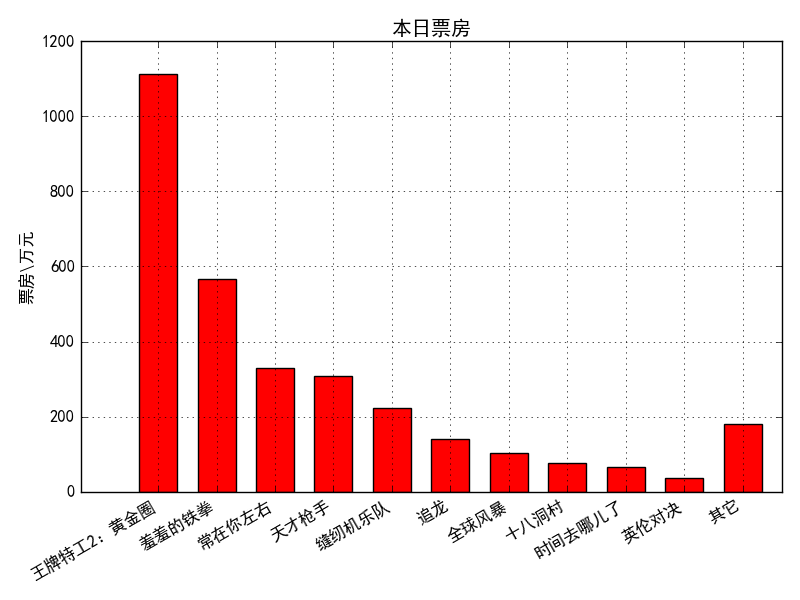
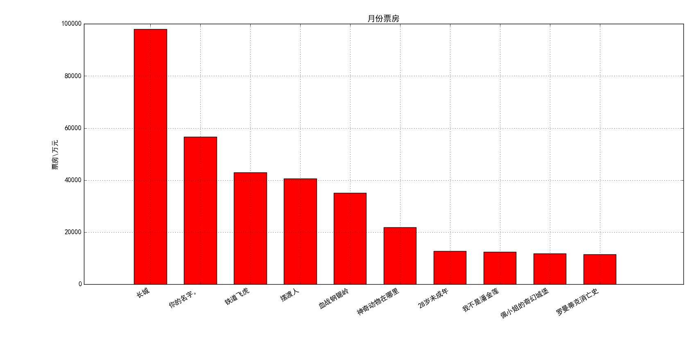
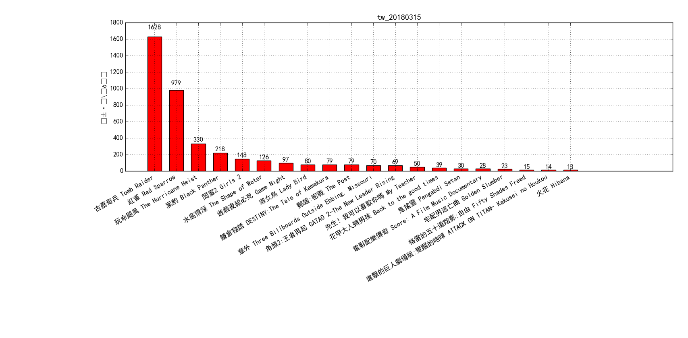
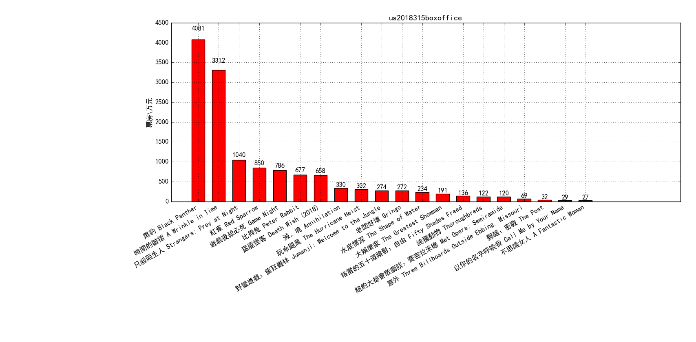

# **BoxOffice_Plot**

0. 本程序可获取内地当天票房和近期历史电影票房数据，台北、美国周末票房数据，并将其可视化。

1. 界面如下：

"今日票房榜"按钮：获取当天票房数据并以excel表格形式保存在data文件夹下，
   并据此绘制当日票房榜,如下图；

   

   "今日票房占比"按钮:获取当天票房数据，并据此绘制当天票房百分占比饼图；

   "总票房榜"按钮：获取当天票房数据，绘制当天上映电影的累计票房柱状图；

   "总票房占比"按钮：获取当天票房数据，绘制当天上映电影累计票房的百分占比饼图。

   "月票房榜"按钮：获取指定月份的票房数据，并绘制该月票房榜（以“xxxx-xx"形式输入指定月份），如下图；

  

   "月票房占比"按钮：获取指定月份的票房数据，并绘制该月上映电影票房的百分之百饼图。

   "台北周末票房"按钮：获取台北最近一个周末（周五到周日）的票房数据，如下图；

   

   "美国周末票房"按钮：获取美国最近一个周末（周五到周日）的票房数据，如下图；

   

2. 票房数据均采集自第三方网站，本程序不负责其真实性或精确性。

## Note 注意事项:
1.BoxOfficeGui.py需安装以下第三方库，本脚本才能正常运行：
wx,tushare,matplotlib,pandas,numpy。
1.1.BoxOfficeGui.py需要wx2.8版本.
1.2.BoxOfficeGui(wx4).py可以在wx4.0版本下运行.

2.BoxOffice_cli.py只需tushare,matplotlib,pandas,numpy即可运行。

## Feedback:
有任何疑问或建议欢迎[反馈](https://github.com/WellenWoo/BoxOffice_Plot.git)。

## Todo:
1. 增加获取台北、北美地区历史票房数据的功能.

